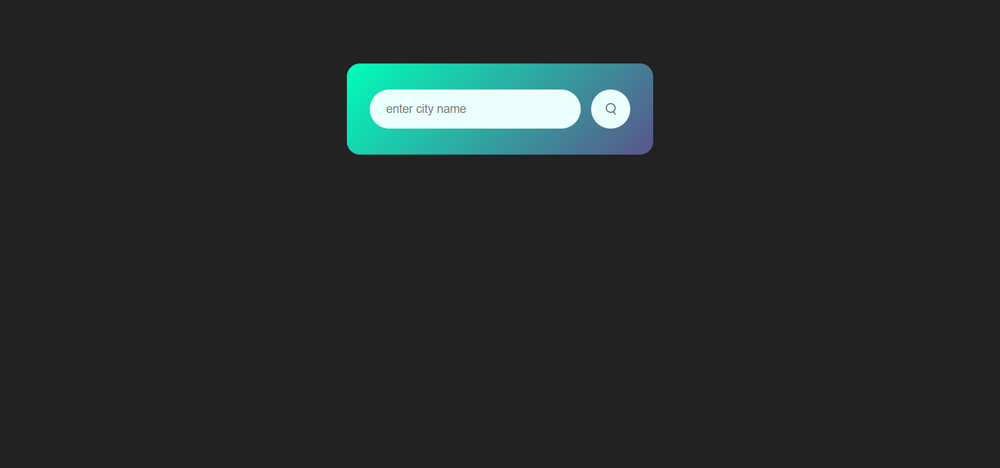
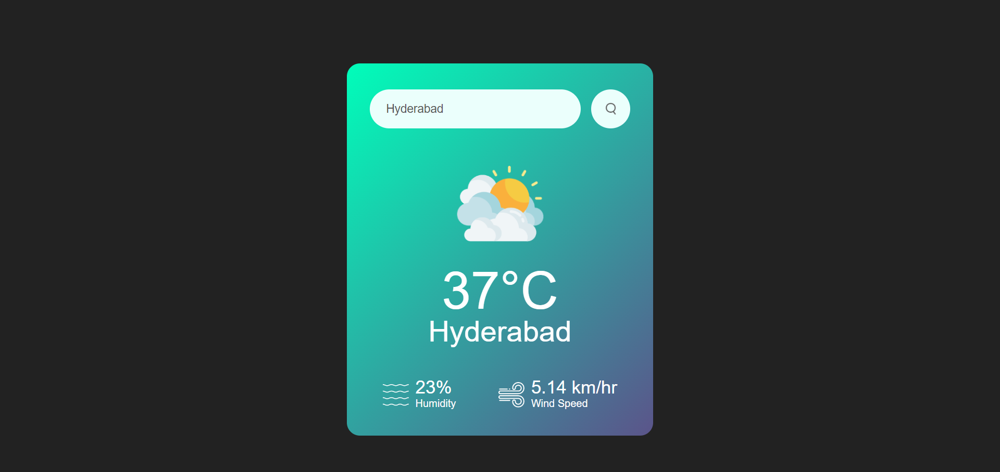

# Weather-app
A Real-time Weather app created using HTML5, CSS3, JavaScript, Weather API.

## Table of contents

- [Overview](#overview)
  - [Screenshot](#screenshot)
  - [Links](#links)
- [My process](#my-process)
  - [Built with](#built-with)
- [Author](#author)

## Overview
  This Project was great and kind of adventurous too, As I have explored working with API for the first time.
  Making it was fun. 

### Screenshot

### Links

- Solution URL: [Github](https://github.com/ManishPulluri/Weather-app)
- Live Site URL: [Github Pages](https://manishpulluri.github.io/Weather-app/)

## My process

### Built with

- HTML5
- CSS3
- JavaScript
- Weather API

## Author

- Twitter - [@manishpulluri_](https://twitter.com/manishpulluri_)